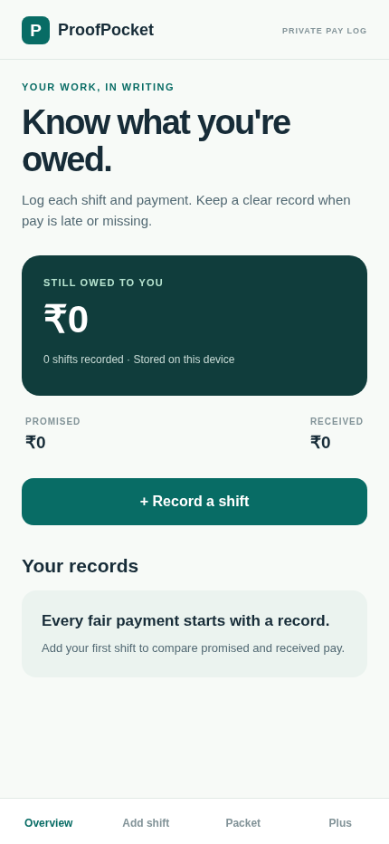

# ProofPocket

**The offline shift and pay log that proves you got paid what you actually earned.**



ProofPocket is built for gig workers, delivery riders, and part-time students whose pay is frequently short and who hold no record of their own. Log every shift by the hour, task or day, record what actually landed, and ProofPocket shows the gap in red: *You logged 11.5 hours. They paid you for 8. ₹630 missing.* One tap turns that into a dated PDF evidence packet. Everything runs on the device. No account, no server, no connection required.

Built with Expo / React Native + TypeScript for the **RevenueCat Shipaton 2026 · Next Gen (student) track**. Open source under MIT.

## The problem

- People paid by the hour, delivery or task get underpaid quietly: an hour missing here, forty deliveries short there.
- Their only record lives inside the platform app that underpaid them. Chat threads and screenshots do not add up to proof.
- Existing trackers are cloud accounts with generic timesheets. None checks the payout, most need connectivity, none is built for cheap phones on patchy networks.

## What ProofPocket does

- **Live shift timer** with breaks and a delivery/task counter. The clock keeps running if you leave the app; ending the shift files it and opens its payout check.
- **Log past shifts** paid per hour, per task, or per day, with partial payments, references and notes.
- **Payout check (the Missing Pay engine):** per client and month, promised versus received, with short pay translated back into unpaid work ("They paid you for 210 of your 240 deliveries").
- **Locked records:** fully paid or settled shifts lock, so a finished record cannot quietly drift before you show it to someone.
- **Evidence packets:** dated PDF per client and monthly PDF reports across clients, generated and shared fully on-device.
- **CSV export, free forever**, with spreadsheet formula-injection escaping.
- **One-tap demo data:** a realistic seeded month (three clients, a few short payments) so anyone can run a full payout check in seconds, then remove it.

## Free vs Plus

| Free forever | ProofPocket Plus (`proofpocket` entitlement) |
|---|---|
| Unlimited shift logging | One-tap PDF evidence packet per client |
| Live timer with breaks and task counter | Monthly PDF pay report across clients |
| Payout checks for any client and month | Full payment timelines inside every report |
| CSV export of the whole ledger | Monthly, Yearly and Lifetime plans, sold in-app |

Logging and checks never need a subscription or a network. Plus is sold through the RevenueCat SDK; without a store key configured, the Plus tab shows an honest preview state and the rest of the app is unaffected.

## Try it in two minutes (for judges)

```bash
git clone https://github.com/iamaanahmad/ProofPocket.git
cd ProofPocket
npm ci
npx expo start
```

Open it in Expo Go (or press `w` for the web preview). On the empty **Overview**, tap **Load demo data**, then open **Check**: Cafe Aroma's September shows ₹1,080 missing, and QuickDash shows 30 of 240 deliveries unpaid. Then start a shift on **Timer**, take a break, end it, and watch it file itself.

To exercise the real paywall, use a development build with a RevenueCat public SDK key in `.env`:

```bash
echo "EXPO_PUBLIC_REVENUECAT_API_KEY=your-public-key" > .env
npx expo run:android   # or an EAS development build
```

A RevenueCat **Test Store** key is enough to buy Monthly / Yearly / Lifetime end to end in the sandbox.

## How it is built

- `ledger.ts` is a pure, tested core: per-unit pay math, settled locking, the payout-check calculation, PDF/CSV packet generation, timer math, and migration of first-version records. `App.tsx` is interface only. `purchases.ts` isolates every RevenueCat call behind lazy native loading, so the app also runs in Expo Go.
- Records persist in AsyncStorage with corruption-safe reads. Nothing leaves the device unless the user shares an export. No analytics, no tracking, no backend to breach or shut down.
- Verification, all passing: 14 ledger unit tests (`npx tsx --test tests/ledger.test.ts`), `npx tsc --noEmit`, and a full bundle export (`npx expo export --platform web`).

## Entry status (honest checklist)

- ✅ Public repository, full source, MIT license detected by GitHub.
- ✅ RevenueCat integrated: `proofpocket` entitlement; paywall lists Monthly / Yearly / Lifetime with live prices; purchase and restore handled with in-app errors.
- 🎥 Demo video (on-device, under 2 minutes, YouTube) and the Devpost submission are completed by the entrant before the deadline; the app's one-tap demo data makes filming the full story take minutes.

## Privacy

Pay records are sensitive, so they never leave the phone by design: no cloud sync, no accounts, no third-party SDKs beyond the store billing SDK, which only sees purchase events.

## License

[MIT](LICENSE) © 2026 Amaan Ahmad.
